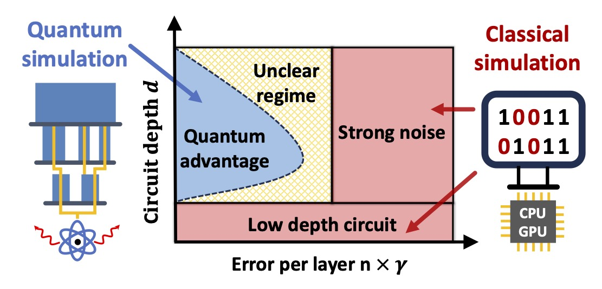
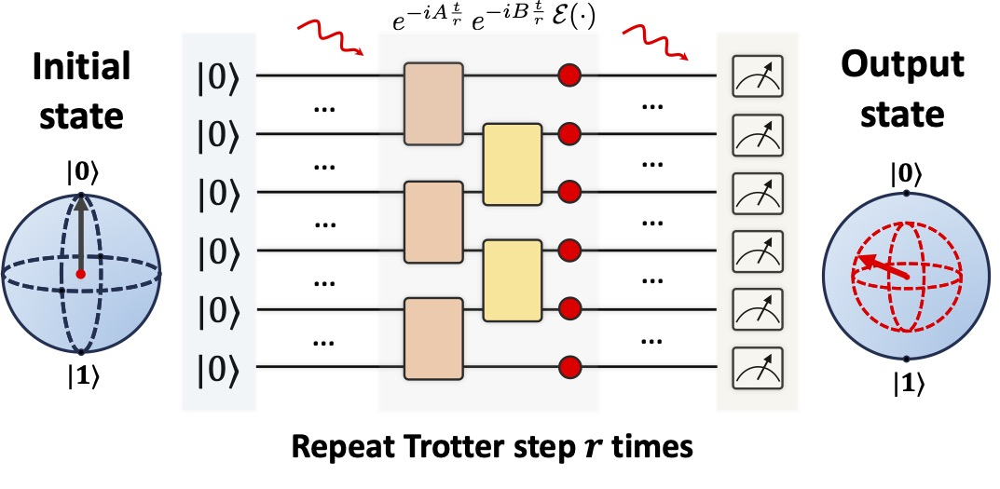

# Trotter Simulation with Noisy Circuit



<!--  -->
[`Exponentially Decaying Quantum Simulation Error with Noisy Devices`](https://arxiv.org/pdf/2502.xxxxx.pdf).
[](https://arxiv.org/abs/2502.xxxxx)

Jue Xu*, Chu Zhao*, Junyu Fan, and Qi Zhao, 2025


## Trotterization with noisy quantum circuit
### Problem Setting


### Results
- [Exponential decay of errors](./error_decay.ipynb)
- [Phase diagram]
- [other impacts]

<!-- ## Classical simulation -->

## Main Reference
- Knee, George C., and William J. Munro. [Optimal Trotterization in universal quantum simulators under faulty control](https://journals.aps.org/pra/abstract/10.1103/PhysRevA.91.052327). Physical Review A 91.5 (2015): 052327.
- Endo, Suguru, et al. [Mitigating algorithmic errors in a Hamiltonian simulation](https://journals.aps.org/pra/abstract/10.1103/PhysRevA.99.012334). Physical Review A 99.1 (2019): 012334.
- Childs, Andrew M., et al. 
[Theory of trotter error with commutator scaling](https://journals.aps.org/prx/abstract/10.1103/PhysRevX.11.011020). Physical Review X 11, 011020 (2021).
- Franca and Garcia-Patron [Limitations of optimization algorithms on noisy quantum devices](https://www.nature.com/articles/s41567-021-01356-3). Nature Physics 17, 1221–1227 (2021)


## Usage 
<!-- - Create python environment `conda create --name myenv python=3.10`
- Install requirements `pip install -r ./code/requirements.txt` -->
```
# Create python environment
conda create --name myenv python=3.10 

# Install requirements
pip install -r ./code/requirements.txt 
```

<!-- ### Requirements
- qiskit version == 
- openfermion
- python (version = 3.10), numpy, scipy, matplotlib, jax -->